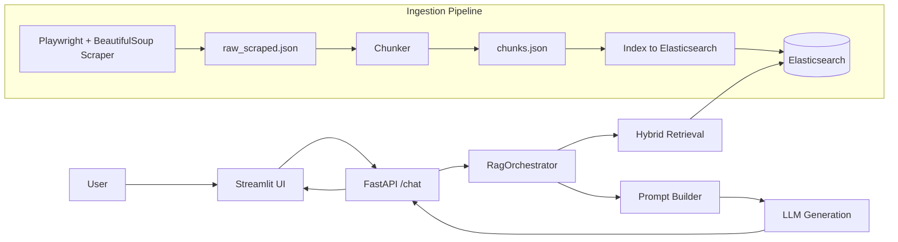

# Housing Chatbot

A housing-domain retrieval augmented generation (RAG) chatbot that scrapes Housing.com content, chunks and indexes it into Elasticsearch, retrieves relevant passages with hybrid search, reranks them with a multilingual reranker, and answers in English or Hindi through a FastAPI backend and Streamlit UI.

## Pipeline First

The system is easiest to understand as a pipeline.



### End-to-end flow

1. The scraper visits selected Housing.com pages with Playwright.
2. The scraper extracts article pages and stores cleaned article text in `scraper/data/raw_scraped.json`.
3. The chunker splits each article into overlapping text chunks and writes `scraper/data/chunks.json`.
4. The indexer embeds each chunk with a multilingual embedding model and stores the vectors in Elasticsearch.
5. The user asks a question in Streamlit.
6. The backend retrieves candidate chunks using dense retrieval plus BM25.
7. The reranker reorders the candidates so the most relevant chunks rise to the top.
8. The backend composes the final prompt with:
   - the system rules
   - the conversation history
   - the retrieved chunks
   - a Hindi or English language instruction based on the prompt language
9. The backend generates the answer using Groq, OpenAI, or the local fallback model.
10. The backend returns the answer plus source metadata to Streamlit.
11. Streamlit renders the answer, the retrieved sources, and the raw prompt when debugging is enabled.

## Tools and Technologies

### User interface

- **Streamlit** powers the chat UI and source display.
- The sidebar controls the backend URL, session ID, top-k retrieval count, custom prompt, and debug mode.

### API layer

- **FastAPI** exposes the `/chat`, `/clear-memory`, and `/ready` endpoints.
- **WhatsApp Cloud API** is supported through `/whatsapp/webhook` for webhook verification and message replies.
- **Twilio WhatsApp** is supported through `/twilio/whatsapp/webhook` and reuses the same chat pipeline.
- **Pydantic** models define request and response schemas.
- **Requests** is used for the remote LLM calls.

### Scraping and document processing

- **Playwright** handles dynamic browsing and page loading.
- **BeautifulSoup4** cleans and parses article HTML.
- **Chunking** breaks long articles into overlapping windows for retrieval.

### Retrieval and indexing

- **Elasticsearch** stores the chunk text and vector embeddings.
- **Dense retrieval** uses embeddings for semantic search.
- **BM25 retrieval** captures lexical overlap.
- **Reciprocal Rank Fusion** merges the dense and lexical results.
- **Reranking** reorders the retrieved passages with a multilingual cross-encoder.

### Language and model stack

- **Transformers** and **Torch** load the embedding, reranker, and local generation models.
- **LangGraph** is used for message-style memory merging.
- **Docker Compose** runs the app and Elasticsearch together.

## Models

### Embedding model

- Default: `BAAI/bge-m3`
- Purpose: create multilingual embeddings for English and Hindi text.
- Used in:
  - `scraper/embeddings.py`
  - `scraper/index_to_elasticsearch.py`
  - `scraper/retriever.py`

### Reranker

- Default: `BAAI/bge-reranker-v2-m3`
- Purpose: score retrieved chunks more precisely than the initial search step.
- Used in `backend/reranker.py`.

### Local fallback LLM

- Default: `Qwen/Qwen3-0.6B`
- Purpose: provide a local generation fallback when Groq or OpenAI is unavailable.
- Used in `backend/local_llm.py`.
- This is already a multilingual model, so the main language adaptation comes from prompt control and retrieval.

### Remote generation models

The backend can call one of three generation modes:

- `groq`: defaults to `llama-3.1-8b-instant`
- `openai`: defaults to `gpt-4o-mini`
- `local`: uses the local Qwen fallback directly

### Language behavior

- The backend detects Hindi prompts by checking for Devanagari characters.
- If the query is Hindi, the system prompt instructs the model to answer in Hindi.
- If the query is English, the model is instructed to answer in English.
- Source citations always keep the same metadata format regardless of language.

## Runtime Logic

### 1. Scraping

Implemented in `scraper/housing_scrapper.py` and launched through `scraper/main.py`.

- The scraper targets a curated list of Housing.com seed URLs.
- For each seed page, it extracts article links.
- It visits each article page and captures:
  - title
  - URL
  - category
  - region
  - cleaned article text
- Documents with very short or unusable text are dropped.
- The final raw documents are written to `scraper/data/raw_scraped.json`.

### 2. Chunking

Implemented in `scraper/chunker.py`.

- Each raw article is normalized to remove extra whitespace.
- Text is split into overlapping chunks.
- Each chunk receives metadata:
  - `document_id`
  - `chunk_id`
  - `chunk_index`
  - `url`
  - `title`
  - `category`
  - `region`
  - `word_count`
- The final chunk file is `scraper/data/chunks.json`.

### 3. Indexing

Implemented in `scraper/index_to_elasticsearch.py`.

- Each chunk is embedded with the multilingual embedding model.
- The index is created with a vector field for semantic retrieval.
- The index name defaults to `housing_chunks_bge_m3`.
- On container start, the index is rebuilt by default so the stored vectors always match the current embedding model.

### 4. Retrieval

Implemented in `scraper/retriever.py` and consumed by `backend/rag_orchestrator.py`.

- Dense retrieval searches vector similarity over Elasticsearch embeddings.
- BM25 retrieval searches the chunk text and title lexically.
- Both result sets are merged with reciprocal rank fusion.
- The backend then fetches the full chunk documents from Elasticsearch.

### 5. Reranking

Implemented in `backend/reranker.py`.

- The retriever first returns a broad candidate pool.
- The reranker scores candidate chunks against the query.
- The top scoring chunks become the final context passed to generation.

### 6. Prompt construction

Implemented in `backend/rag_orchestrator.py` and `backend/prompt.py`.

The final prompt contains:

- the base system rules
- optional custom user instructions
- a Hindi or English language instruction
- recent conversation history
- retrieved chunk context with chunk IDs and URLs
- the current user query

### 7. Answer generation

Implemented in `backend/app.py` and `backend/local_llm.py`.

Generation order:

1. Try Groq if `GENERATION_BACKEND=groq` and `GROQ_API_KEY` exists.
2. Try OpenAI if `GENERATION_BACKEND=openai` and `OPENAI_API_KEY` exists.
3. Fall back to the local Qwen model.

If the remote model returns unusable text, the backend falls back to a concise answer built from the best retrieved chunk.

### 8. Memory

Conversation memory is file-backed per session.

- Saved under `scraper/data/memories/`
- Keyed by session ID
- Stored as JSON conversation turns
- Merged with LangGraph message utilities when available

### 9. Frontend behavior

Implemented in `streamlit_app.py`.

- The UI sends the question and metadata to the backend `/chat` endpoint.
- It stores the latest answer and sources in session state.
- It shows retrieved sources in a separate panel.
- It supports clearing the session memory through the backend.
- It normalizes bad backend URL values and defaults to `http://localhost:8000/chat`.

### 10. WhatsApp integration

Implemented in `backend/whatsapp.py` and wired through `backend/app.py`.

- Set `WHATSAPP_VERIFY_TOKEN` to the token configured in Meta's webhook settings.
- Set `WHATSAPP_PHONE_NUMBER_ID` and `WHATSAPP_ACCESS_TOKEN` so the backend can send replies.
- Meta should call `GET /whatsapp/webhook` for verification.
- Meta should send incoming messages to `POST /whatsapp/webhook`.
- The backend reuses the same retrieval, reranking, and generation flow as the Streamlit UI.
- Replies sent back to WhatsApp include the answer plus a short source list with chunk IDs and URLs.

### 11. Twilio WhatsApp integration

Implemented in `backend/twilio_whatsapp.py` and wired through `backend/app.py`.

This path is the easiest way to test WhatsApp with free trial credits because it uses Twilio's WhatsApp sandbox and returns TwiML directly from the backend.

- Create a Twilio account and enable the WhatsApp sandbox.
- Join the sandbox from your phone using the code Twilio gives you.
- Set the Twilio sandbox webhook URL to `https://<your-public-host>/twilio/whatsapp/webhook`.
- Expose your local backend with an HTTPS tunnel such as ngrok or cloudflared.
- The backend reads inbound Twilio form fields like `Body` and `From`, then calls the same `build_chat_response` flow used by `/chat`.
- The backend returns a TwiML `<Message>` response, so Twilio sends the reply back to WhatsApp automatically.
- Replies include the answer plus chunk IDs and URLs from the retrieved sources.
- For local development, run `scripts/expose_backend.sh` to open a public HTTPS tunnel using `cloudflared` or `ngrok`.
- Set the Twilio sandbox webhook to `https://<your-public-host>/twilio/whatsapp/webhook`.
- If you prefer to run the tunnel manually, use `cloudflared tunnel --url http://127.0.0.1:8000` or `ngrok http 8000`.

## API Endpoints

### `POST /chat`

Request fields:

- `session_id`
- `query`
- `top_k`
- `system_prompt`
- `debug_prompt`

Response fields:

- `session_id`
- `answer`
- `sources`
- `raw_llm`

### `POST /clear-memory`

Clears the saved session conversation memory.

### `GET /ready`

Simple readiness endpoint used by the container startup script.

## Repository Structure

```text
housing_chatbot/
├── backend/
│   ├── app.py
│   ├── local_llm.py
│   ├── models.py
│   ├── prompt.py
│   ├── rag_orchestrator.py
│   └── reranker.py
├── scraper/
│   ├── housing_scrapper.py
│   ├── chunker.py
│   ├── embeddings.py
│   ├── index_to_elasticsearch.py
│   ├── retriever.py
│   └── main.py
├── streamlit_app.py
├── entrypoint.sh
├── Dockerfile
├── docker-compose.yml
├── pyproject.toml
└── README.md
```

## Configuration

These environment variables control the system:

| Variable | Purpose | Default |
| --- | --- | --- |
| `BACKEND_URL` | Streamlit backend URL | `http://localhost:8000/chat` |
| `ELASTICSEARCH_URL` | Elasticsearch service URL | `http://localhost:9200` locally, `http://elasticsearch:9200` in Docker |
| `ELASTICSEARCH_INDEX_NAME` | Elasticsearch index name | `housing_chunks_bge_m3` |
| `EMBEDDING_MODEL` | Embedding model override | `BAAI/bge-m3` |
| `LOCAL_LLM_MODEL` | Local generation model override | `Qwen/Qwen3-0.6B` |
| `GENERATION_BACKEND` | `groq`, `openai`, or `local` | `groq` |
| `GROQ_API_KEY` | Groq API key | unset |
| `GROQ_MODEL` | Groq model name | `llama-3.1-8b-instant` |
| `OPENAI_API_KEY` | OpenAI API key | unset |
| `OPENAI_MODEL` | OpenAI model name | `gpt-4o-mini` |
| `TWILIO_TOP_K` | Number of retrieved chunks to use for Twilio replies | `3` |
| `SCRAPER_RUN_ON_START` | Run scraper when container starts | `0` |
| `REINDEX_ON_START` | Rebuild Elasticsearch index on container start | `1` |
| `FORCE_RECREATE_INDEX` | Force index recreation when indexing | `1` |

## Docker Setup

The app is designed to run as a single application image plus an Elasticsearch service.

- The `app` service builds the Python image.
- The `elasticsearch` service stores the vector index.
- `entrypoint.sh` optionally runs scraping and always rebuilds the Elasticsearch index by default so the embedding model and stored vectors stay aligned.
- The backend waits for Elasticsearch and the API readiness endpoint before Streamlit starts.

Start everything with:

```bash
docker compose up --build
```

Then open:

- Streamlit: http://localhost:8501
- FastAPI docs: http://localhost:8000/docs
- Elasticsearch: http://localhost:9200

## Local Development

If you prefer to run things manually:

### 1. Scrape and build the data

```bash
python -m scraper.main
python -m scraper.index_to_elasticsearch
```

### 2. Start the backend

```bash
uvicorn backend.app:app --reload --port 8000
```

### 3. Start Streamlit

```bash
streamlit run streamlit_app.py
```

### 4. Optional Twilio WhatsApp setup

If you want WhatsApp access through Twilio instead of the Meta Cloud API:

1. Enable the Twilio WhatsApp sandbox in your Twilio console.
2. Start the tunnel with `scripts/expose_backend.sh` or a manual `ngrok` / `cloudflared` command.
3. Set the sandbox webhook to `https://<your-public-host>/twilio/whatsapp/webhook`.
4. Start the backend with `uvicorn backend.app:app --reload --port 8000`.
5. Send a WhatsApp message to the sandbox number from your phone.

Example local environment values:

```bash
TWILIO_TOP_K=3
```

## Notes    

- The dataset is currently centered on Delhi NCR Housing.com content.
- The backend preserves source metadata so every answer can be traced back to a chunk ID and URL.
- If the retrieval filter becomes too aggressive for a query, the backend falls back to the top retrieved hits instead of returning no sources.
- If you change the embedding model, rebuild the Elasticsearch index so the vectors match the new model.
- The repo currently uses `python-dotenv`, so local `.env` values are loaded by the backend.
